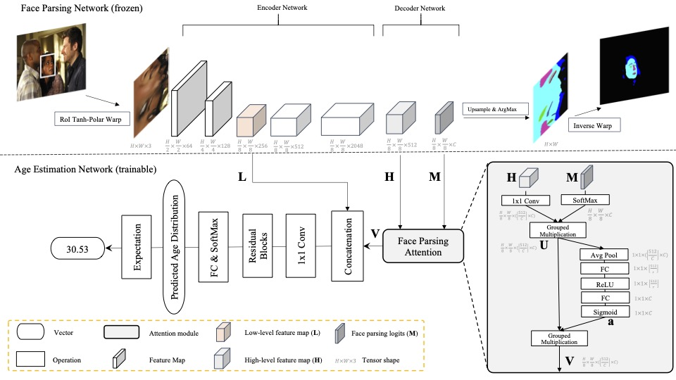

# FP-Age: Leveraging Face Parsing Attention for Facial Age Estimation in the Wild
[](https://paperswithcode.com/sota/age-estimation-on-kanface?p=fp-age-leveraging-face-parsing-attention-for)
[](https://paperswithcode.com/sota/age-estimation-on-imdb-clean?p=fp-age-leveraging-face-parsing-attention-for)

Official repo for our paper *FP-Age: Leveraging Face Parsing Attention for Facial Age Estimation in the Wild*,
accepted by IEEE Transactions on Image Processing (TIP). For IMDB-Clean, please visit <https://github.com/yiminglin-ai/imdb-clean>.



## How to Install

Dependencies

* [Numpy](https://www.numpy.org/)
* [OpenCV](https://opencv.org/)
* [PyTorch](https://pytorch.org/)
* [ibug.roi_tanh_warping](https://github.com/ibug-group/roi_tanh_warping): See this repository for details: [https://github.com/ibug-group/roi_tanh_warping](https://github.com/ibug-group/roi_tanh_warping).
* [ibug.face_parsing](https://github.com/hhj1897/face_parsing): See this repository for details: [https://github.com/hhj1897/face_parsing](https://github.com/hhj1897/face_parsing).
* [ibug.face_detection](https://github.com/hhj1897/face_detection) (only needed by the test script): See this repository for details.

After installing the needed dependencies, run the following commands in bash:

```bash
git clone --recursive https://github.com/ibug-group/fpage
cd fpage
pip install -e .
```

## Pretrained weights

Download the pretrained weights and unzip them in `ibug/age_estimation/weights/`

* weights for FP-Age: <https://ibug.doc.ic.ac.uk/download/fpage/fpage-resnet50-fcn-14-97.torch>
* weights for baselines: <https://ibug.doc.ic.ac.uk/download/fpage/baselines.zip>

## How to run the demo

To run FP-Age using the webcam as input:

```bash
python fpage_test.py -i 0 -d cpu # CAUTION: running on CPU is slow
```

To run on CUDA (Recommended):

```bash
python fpage_test.py -i 0 -d cuda:0 
```

Command-line arguments:

```
-i VIDEO: Index of the webcam to use (start from 0) or
          path of the input video file
-d: Device to be used by PyTorch (default=cuda:0)
```

Label map for parsing:

```
0 : background
1 : skin (including face and scalp)
2 : left_eyebrow
3 : right_eyebrow
4 : left_eye
5 : right_eye
6 : nose
7 : upper_lip
8 : inner_mouth
9 : lower_lip
10 : hair
11 : left_ear
12 : right_ear
13 : glasses
```

## IMDB-Clean

We provide [IMDB-Clean](https://github.com/yiminglin-ai/imdb-clean) for training and testing age estimation models. Please refer to <https://github.com/yiminglin-ai/imdb-clean> for details.

## Baselines

To test baselines, download checkpoints and unzip it under `weights` folder, then run `baseline_test.py`:

```
python baseline_test.py -d cpu --loss dex --age-classes 101
python baseline_test.py -d cpu --loss mv --age-classes 101 # mean variance loss
python baseline_test.py -d cpu --loss dldl --age-classes 101
python baseline_test.py -d cpu --loss dldlv2 --age-classes 101
python baseline_test.py -d cpu --loss ord --age-classes 101
```

Please refer to our paper for the details of the baselines.

## Demo


## Reference

__Note__: If you use this repository in your research, we kindly request you to cite the [following paper](https://arxiv.org/abs/2106.11145):

* Lin, Yiming, Jie Shen, Yujiang Wang, and Maja Pantic. "FP-Age: Leveraging Face Parsing Attention for Facial Age Estimation in the Wild." arXiv preprint arXiv:2106.11145 (2021).

Bibtex:

```bibtex
@misc{lin2021fpage,
      title={FP-Age: Leveraging Face Parsing Attention for Facial Age Estimation in the Wild}, 
      author={Yiming Lin and Jie Shen and Yujiang Wang and Maja Pantic},
      year={2021},
      eprint={2106.11145},
      archivePrefix={arXiv},
      primaryClass={cs.CV}
}
```
